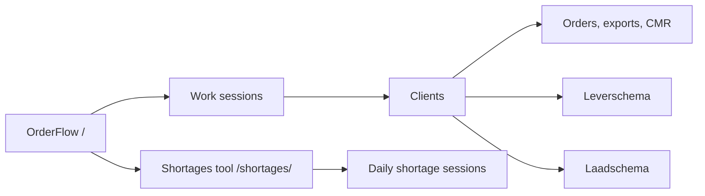
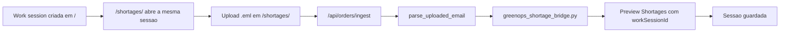

# Arquitetura

## Visao geral

OrderFlow tem uma pagina principal de operacao de encomendas e uma ferramenta de Shortage Control integrada.

## Ingest de encomenda para Shortages

Cada encomenda encontrada no `.eml` vira uma entrada de shortage separada:

- `orderedQuantity` vem da quantidade encomendada.
- `deliveredQuantity` comeca igual ao ordered.
- `shortageQuantity` comeca em `0`.
- O utilizador atualiza os shortages reais mais tarde no historico.
- `workSessionId` liga os shortages a mesma sessao criada na pagina inicial.

## UI

O CSS principal em `public/styles.css` aplica a linguagem visual do Shortages ao OrderFlow:

- fundo verde claro
- topo verde escuro
- paineis brancos
- bordas de 8px
- botoes verdes
- tabelas e formularios consistentes

`public/shortages/styles.css` mantem a mesma base visual para a ferramenta de shortages.
